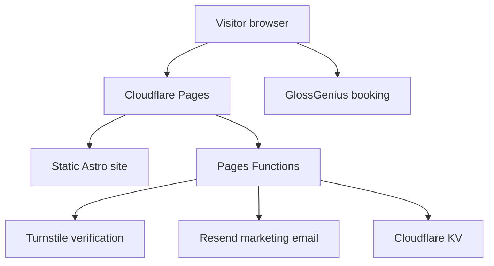

# Architecture

## System overview

Viva is an Astro static site deployed on Cloudflare Pages. Most requests are served as generated HTML, CSS, JavaScript, fonts, and images. A small set of Pages Functions handles non-clinical marketing email and unsubscribe operations.

GlossGenius is an external booking destination. Clinical communication and patient records belong in Viva's EHR and are intentionally outside this architecture.

## Application layers

| Layer | Location | Responsibility |
|---|---|---|
| Pages | `src/pages/` | Routes, page-level semantics, metadata inputs, and page-specific styles |
| Components | `src/components/` | Shared navigation, footer, calls to action, notices, and repeated UI |
| Layout | `src/layouts/Layout.astro` | Document shell, canonical metadata, schema graph, fonts, transitions, and optional analytics |
| Content data | `src/lib/` and `src/content/` | Care-path logic, directory/perk data, and editorial content |
| Design system | `src/styles/` | Tokens, typography, layout primitives, focus styles, and global responsive rules |
| Edge functions | `functions/api/` | Lead email, unsubscribe, signed webhooks, rate limiting, and restricted delivery status |
| Contracts | `scripts/` and `tests/` | Protected-content guard plus browser-level functional and quality checks |

## Data boundaries

The public contact pipeline is for non-clinical marketing inquiries. It must not solicit or accept health information. `NoPhiNotice` explains that boundary at form surfaces.

The following may be handled by the marketing pipeline when voluntarily submitted: name, email address, phone number, and non-clinical source/care-path identifiers. Symptoms, diagnoses, medications, laboratory data, insurance details, and appointment-specific clinical information do not belong in Resend, KV, analytics, logs, fixtures, or GitHub.

KV stores suppression state, scheduled-message IDs, rate-limit state, and a deliberately minimal email-status log. The delivery log must not add message subjects or care-path labels that could turn an email address into health-related information.

## Security controls

- Turnstile can reject automated public-form submissions.
- KV-backed rate limits reduce email cost amplification and fail open to avoid blocking legitimate leads during a KV outage.
- Resend webhooks require signature verification.
- Unsubscribe links are HMAC-signed when `UNSUB_SECRET` is configured.
- The delivery-status endpoint fails closed unless Cloudflare Access or the bearer-token path is configured.
- CI runs the protected-content guard, static build, and full Playwright suite.
- GitHub Actions are pinned to immutable commit SHAs.

## Design constraints

The site must remain useful without client-side JavaScript wherever practical. Responsive behavior is CSS-first. External links disclose when they open a new tab, and affiliate or referral relationships are disclosed next to the relevant action.
