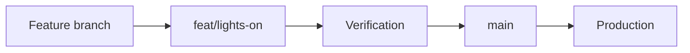

# Deployment

## Release model

Cloudflare Pages deploys `main` to production at [vivawellnessco.com](https://vivawellnessco.com/). `feat/lights-on` is the reviewed integration branch. Feature work starts from integration and returns there before production promotion.

Never force-push `main`. Promotion requires Michael's explicit approval because a push is a live deployment.

## Cloudflare Pages configuration

| Setting | Value |
|---|---|
| Production branch | `main` |
| Build command | `npm run build` |
| Build output | `dist` |
| Node.js | 22.12.0 or a compatible supported 22.x release |
| Functions directory | `functions/` |

Preview and feedback deployments should set `PUBLIC_DEPLOY_TARGET=feedback`. The layout then emits noindex behavior and the Turnstile helper uses its non-production key path.

## Environment inventory

Store real values in Cloudflare's encrypted environment configuration. Never commit values to GitHub.

| Name | Sensitivity | Purpose |
|---|---|---|
| `PUBLIC_DEPLOY_TARGET` | Public | Marks a build as `feedback` rather than production |
| `PUBLIC_PLAUSIBLE_DOMAIN` | Public | Enables Plausible for the named public domain when set |
| `SITE_ORIGIN` | Configuration | Canonical origin used in generated email links |
| `DISCOVERY_CALL_URL` | Configuration | Approved destination for email calls to action |
| `CAN_SPAM_ADDRESS` | Sensitive business data | Postal footer required for marketing email |
| `RESEND_API_KEY` | Secret | Authorizes Resend API requests |
| `RESEND_FROM_EMAIL` | Configuration | Verified sender identity |
| `RESEND_NOTIFY_EMAIL` | Sensitive business data | Internal destination for non-clinical lead notices |
| `RESEND_AUDIENCE_ID` | Secret-like identifier | Optional Resend audience destination |
| `RESEND_WEBHOOK_SECRET` | Secret | Verifies Resend/Svix webhook signatures |
| `UNSUB_SECRET` | Secret | Signs one-click unsubscribe links |
| `EMAIL_STATUS_TOKEN` | Secret | Authorizes scripted delivery-status access |
| `ACCESS_TEAM_DOMAIN` | Configuration | Cloudflare Access issuer domain |
| `ACCESS_AUD` | Secret-like identifier | Expected Cloudflare Access audience |
| `TURNSTILE_SECRET_KEY` | Secret | Server-side Turnstile verification |
| `LEADS_KV` | Binding | KV namespace for rate limits, suppression, and minimal status records |

Use `.env.example` only as a local name inventory. Its values are intentionally non-functional.

## Pre-release checklist

1. Fetch the current remote integration and production refs.
2. Confirm the feature branch is based on the current `feat/lights-on`.
3. Review `git diff --check` and the complete diff.
4. Run `npm ci` when dependency metadata changed.
5. Run `npm run verify`.
6. Review visible changes at mobile, tablet, and desktop widths.
7. Confirm booking links and partner links without submitting a form or appointment.
8. Confirm no secrets or personal/health information entered the diff.
9. Merge or fast-forward the verified commit into `feat/lights-on`.
10. With explicit approval, fast-forward `main` to the exact integration commit.

## Production smoke check

After Cloudflare reports a successful deployment:

- confirm `/`, `/services/`, `/start/`, `/partners/`, and `/contact/` return successfully;
- confirm the production commit matches the approved SHA;
- check the header and primary call to action at a narrow mobile width;
- check the homepage hero at a wide desktop width;
- confirm booking and partner destinations by inspecting or opening links only; and
- do not submit a real lead or appointment as a smoke test.

If production is materially broken, follow [the rollback runbook](./runbooks/rollback.md).
